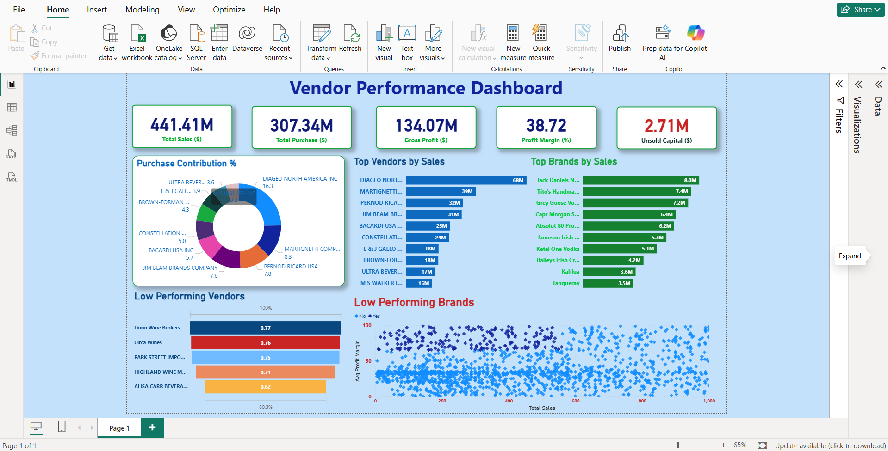

# 🧾 Vendor Performance Analysis – Retail Inventory & Sales

_Analyzing vendor efficiency and profitability to support strategic purchasing and inventory decisions using SQL, Python, and Power BI._

---

## 📌 Table of Contents
- <a href="#overview">Overview</a>
- <a href="#business-problem">Business Problem</a>
- <a href="#dataset">Dataset</a>
- <a href="#tools--technologies">Tools & Technologies</a>
- <a href="#project-structure">Project Structure</a>
- <a href="#data-cleaning--preparation">Data Cleaning & Preparation</a>
- <a href="#exploratory-data-analysis-eda">Exploratory Data Analysis (EDA)</a>
- <a href="#research-questions--key-findings">Research Questions & Key Findings</a>
- <a href="#dashboard">Dashboard</a>
- <a href="#how-to-run-this-project">How to Run This Project</a>
- <a href="#final-recommendations">Final Recommendations</a>

---

<h2><a class="anchor" id="overview"></a>Overview</h2>

This project provides a comprehensive analysis of vendor performance and retail inventory to help drive data-driven purchasing, pricing, and inventory optimization decisions.  
It integrates SQL for ETL, Python for advanced analysis, and Power BI for dashboard visualization — building a complete end-to-end analytics solution.

---

<h2><a class="anchor" id="business-problem"></a>Business Problem</h2>

Efficient management of inventory and vendor relationships is essential to maintain profitability in retail operations.  
This project aims to:

- Identify underperforming brands that may need pricing or promotional adjustments  
- Measure vendor-level contribution to total sales and profit  
- Quantify cost benefits from bulk purchasing  
- Detect inefficiencies in inventory turnover  
- Statistically evaluate differences in vendor profitability  

---

<h2><a class="anchor" id="dataset"></a>Dataset</h2>

- Multiple CSV files stored in `/data/` directory (`sales`, `vendors`, `inventory`)  
- A **summary table** is generated by merging and aggregating data for vendor-level analysis  

---

<h2><a class="anchor" id="tools--technologies"></a>Tools & Technologies</h2>

- **SQL** → Data extraction, cleaning, and transformation using CTEs, Joins, and Filters  
- **Python** → Analytical computation and hypothesis testing (`Pandas`, `Matplotlib`, `Seaborn`, `SciPy`)  
- **Power BI** → Interactive dashboards and visual insights  
- **GitHub** → Version control and documentation  

---

<h2><a class="anchor" id="project-structure"></a>Project Structure</h2>

```
vendor-performance-analysis/
│
├── README.md
├── .gitignore
├── requirements.txt
├── Vendor Performance Report.pdf
│
├── notebooks/                  # Jupyter notebooks
│   ├── exploratory_data_analysis.ipynb
│   ├── vendor_performance_analysis.ipynb
│   ├── vendor.ipynb
│
├── scripts/                    # Python scripts for ingestion and processing
│   ├── ingestion_db.py
│   └── get_vendor_summary.py
│
├── dashboard/                  # Power BI dashboard file
│   └── vendor_performance_dashboard.pbix
```


---

<h2><a class="anchor" id="data-cleaning--preparation"></a>Data Cleaning & Preparation</h2>

Data preprocessing steps included:

- **Filtering invalid records**:
  - Removed rows where `Gross Profit ≤ 0`
  - Removed rows where `Profit Margin ≤ 0`
  - Excluded transactions with `Sales Quantity = 0`
- **Data consistency**:
  - Standardized data types (dates, floats, and categories)
  - Handled outliers and missing values
- **Aggregation**:
  - Created vendor-level summary tables with metrics such as average profit, total sales, and margin  

---

<h2><a class="anchor" id="exploratory-data-analysis-eda"></a>Exploratory Data Analysis (EDA)</h2>

**Negative or Zero Values Detected:**
- Gross Profit: Min **-52,002.78** (loss-making sales)
- Profit Margin: Min **-∞** (sales at or below cost)
- Unsold Inventory detected → indicates slow-moving or obsolete stock

**Outliers Identified:**
- Freight Costs as high as **257K**
- Unusually large purchase and sales prices

**Correlation Insights:**
- Weak correlation between Purchase Price & Profit  
- Strong correlation between Purchase Quantity & Sales Quantity (**0.999**)  
- Negative correlation between Profit Margin & Sales Price (**-0.179**)  

---

<h2><a class="anchor" id="research-questions--key-findings"></a>Research Questions & Key Findings</h2>

1. **Brands for Promotions:** 198 brands with low sales but high profit margins  
2. **Top Vendors:** Top 10 vendors account for **65.69%** of purchases → over-reliance risk  
3. **Bulk Purchasing Impact:** Achieved **72% cost savings per unit** in bulk orders  
4. **Inventory Turnover:** $2.71M worth of unsold inventory detected  
5. **Vendor Profitability Comparison:**
   - High-performing vendors → Mean Margin = **31.17%**
   - Low-performing vendors → Mean Margin = **41.55%**
6. **Hypothesis Testing Results:** Statistically significant difference in profit margins → confirms distinct vendor strategies  

---

<h2><a class="anchor" id="dashboard"></a>Dashboard</h2>

**Power BI Dashboard Highlights:**
- Vendor-wise Sales & Profitability Overview  
- Inventory Turnover and Stock Insights  
- Bulk Purchase Cost Savings Visualization  
- Performance Heatmaps by Brand and Vendor  



---

<h2><a class="anchor" id="how-to-run-this-project"></a>How to Run This Project</h2>

1. **Clone the repository:**
   ```bash
   git clone https://github.com/yourusername/vendor-performance-analysis.git

2. **Load and ingest CSV data into database:**
```bash
python scripts/ingestion_db.py
```
3. Create vendor summary table:
```bash
python scripts/get_vendor_summary.py
```
4. Open and run notebooks:
   - `notebooks/exploratory_data_analysis.ipynb`
   - `notebooks/vendor_performance_analysis.ipynb`
5. Open Power BI Dashboard:
   - `dashboard/vendor_performance_dashboard.pbix`

---

<h2><a class="anchor" id="final-recommendations"></a>Final Recommendations</h2>

- Diversify vendor base to reduce risk
- Optimize bulk order strategies
- Reprice slow-moving, high-margin brands
- Clear unsold inventory strategically
- Improve marketing for underperforming vendors

